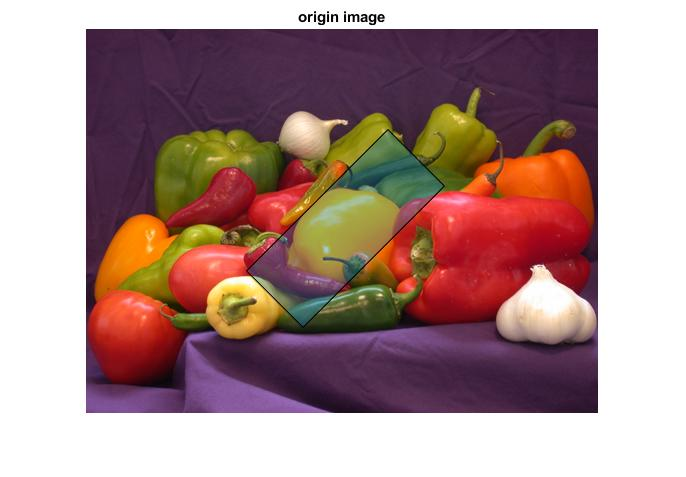
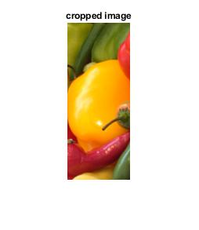

# imageRectCrop
An enhanced version of matlab's built-in function 'imcrop', supporting rotated rectangles

## Example
```matlab
srcImg = imread('peppers.png');
cropRect = [260,200,80,200,pi/4];% [centerX,centerY,width,height,yaw]

% crop rotate rectangle image
cropedImg = imgCrop(srcImg,cropRect);

% show result
rect = [cropRect(1:4),cropRect(5)*180/pi];
verticles = getVertices(rect);
p = polyshape(verticles(:,1),verticles(:,2));
figure;imshow(srcImg);hold on; plot(p);title('origin image');
```

```matlab
figure;imshow(cropedImg);title('cropped image')
```

